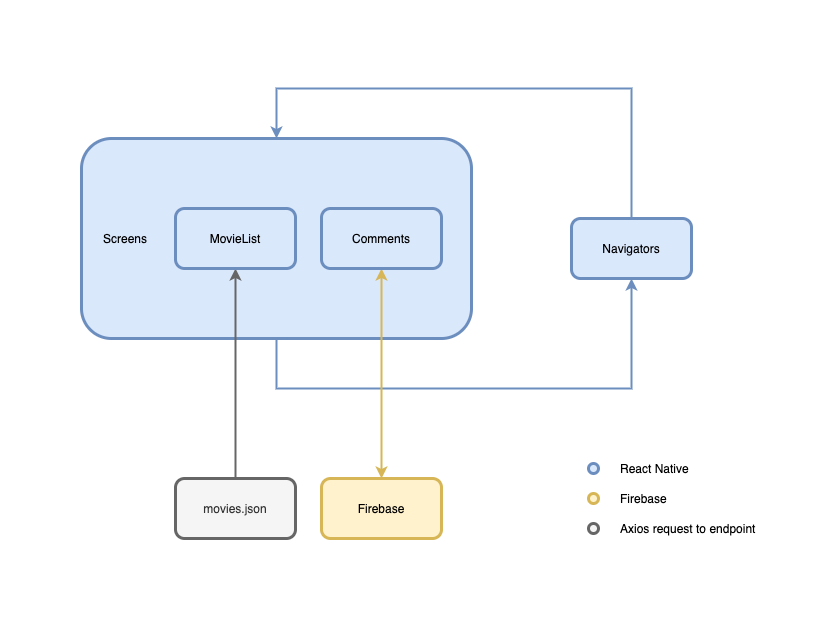
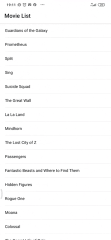

# Turtle Trial - Movie App


This project is an app made with React Native to show a list of movies and it's comments.

## Set up Firebase

Before running the project it's necessary to set up a firebase connection. 

[Create a firebase project](https://firebase.google.com/), and add it's configuration on `src/utils/firebaseConfig.js`. Use the template file [firebaseConfig_template.js](./src/utils/firebaseConfig_template.js).

Make sure your Firebase Realtime Database have read and write permissions. Change the rules of your database to the following:
```
  "rules": {
    ".read": true,
    ".write": true
  }
}
```

## Run the app with Docker
Create a file named `.env` in the project root, with the following line:

```
REACT_NATIVE_PACKAGER_HOSTNAME=[Your IP address]
```

Change from `[Your IP address]` to your computer's IP address. See the example on [.env_template](./.env_template).

Inside the project folder use the following command to run the app on a docker container:

```sh
docker-compose up
```

## Run the app without Docker

Make sure you have expo installed:

```sh
yarn global add expo-cli
```

Install the packages:

```sh 
yarn
```

Run the app:

```sh
yarn start
```

## Access the App
Intall Expo on your smartphone. See the following links:
- [Play Store](https://play.google.com/store/apps/details?id=host.exp.exponent&hl=en_US)
- [App Store](https://apps.apple.com/br/app/expo-client/id982107779)

Scan the QR code displayed with your smartphone and wait for the app to build.

Make sure your computer and phone are in the same network.

## Architecture



The app was made with React Native framework, using Expo. It contains two pages, Movie List and Comments.

The Movie List uses axios to get the movies json from the endpoint `https://tender-mclean-00a2bd.netlify.app/mobile/movies.json`.

For the Comments, there is a firebase app that associate a list of comments with each movie from movie.json. The Comments page connects with the firebase database to show the movie comments and add new ones.

The source code was divided into three folders, pages, wich contains the app pages (Movie List and Comments), navigators, contains the app navigation system to move between those pages, and utils, wich have the movie.json request, firebase connection and configuration.

The choice for using Expo instead of React Native CLI was made for the easier to set environment and it covers all the app's needs in this case.

## What to improve

The app is still missing a login system. The app currently only accepts anonymous comments. With a login system it would be possible to associate a comment to the logged user.

## Working example

<div style="text-align:center">
  
</div>
